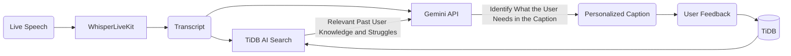

# System Architecture

```mermaid
flowchart LR
    A(Live Speech)
    B[WhisperLiveKit]
    C(Transcript)
    D[TiDB AI Search]
    E[Gemini API]
    F(Personalized Caption)
    G(User Feedback)
    H[(TiDB)]
    
    A --> B
    B --> C

    C --> D

    C --> E
    D -->|Relevant Past User Knowledge and Struggles| E

    E -->|Identify What the User Needs in the Caption| F
    F --> G

    G --> H
    H --> D 
```

