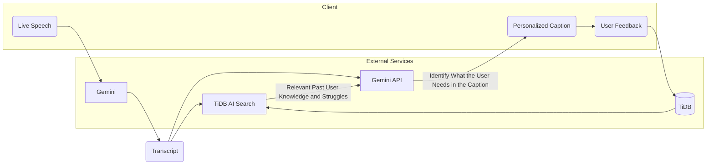

# System Architecture

```mermaid
flowchart LR
    subgraph Client
        A(Live Speech)
        F(Personalized Caption)
        G(User Feedback)
    end
    C(Transcript)
    subgraph External Services
        B[Gemini]
        D[TiDB AI Search]
        E[Gemini API]
        H[(TiDB)]
    end
    
    A --> B
    B --> C

    C --> D

    C --> E
    D -->|Relevant Past User Knowledge and Struggles| E

    E -->|Identify What the User Needs in the Caption| F
    F --> G

    G --> H
    H --> D 
```
