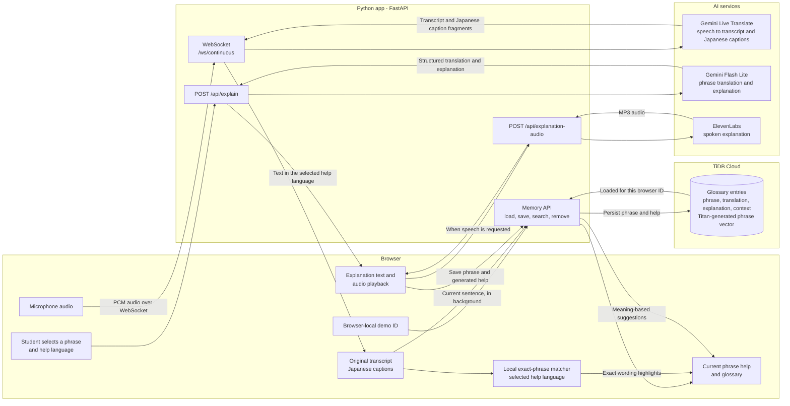

# System architecture

This diagram shows the current live-caption flow and the on-demand personal glossary.
Live captions stay visible in Japanese; saved explanations are separate, and ElevenLabs
speaks explanations only when requested.

## Main boundaries

- **Browser:** captures audio, displays captions, recognizes exact saved wording locally,
  and presents explanations. The demo ID is stored in that browser; it is not a login.
- **FastAPI:** holds provider/database credentials and coordinates WebSocket audio,
  explanations, speech requests, and glossary endpoints.
- **Gemini Live Translate:** handles the continuous caption stream. Generated audio from
  this live-caption route is discarded.
- **Gemini Flash Lite:** creates a short phrase translation and contextual explanation
  only when the student requests help. Exact and semantic recognition do not call Gemini.
- **ElevenLabs:** speaks explanation text in the selected help language. It does not
  currently speak the continuous live captions.
- **TiDB Cloud:** stores active glossary entries and retrieves related phrases. Its Titan
  stored Auto Embedding vector represents the saved phrase (`content`). Searches also
  compare the new sentence with the saved source example using TiDB embeddings; this
  needs no table migration or Gemini call. Semantic matches remain suggestions and may
  not fit the current lecture.

Glossary searches run in the background; captions do not wait for database results.
Saved entries are scoped by browser demo ID and selected help language. The shared demo
database has no authenticated account boundary.
