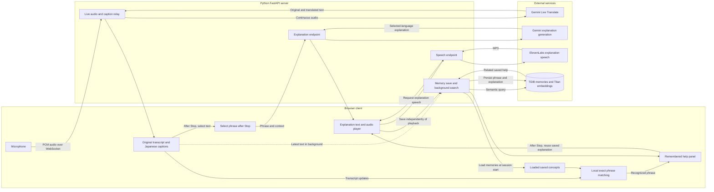

# System architecture

This diagram describes the current demo plus the TiDB website integration in PR #8.
That integration has simulated checks; real database persistence and latency still
need verification. See [the design document](design-document.md) for limitations.

## Reading the diagram

- The live-caption path runs continuously and does not wait for database searches.
- Selection sends an explanation request only when the user clicks Explain.
- Recognized wording uses local matching; paraphrases use TiDB search and are suggestions.
- Saved explanation text can be reused without Gemini generation. Speech may still need ElevenLabs.
- TiDB stores concepts/explanations, not audio recordings. The browser holds temporary audio caches.
- Full Japanese captions remain enabled. Phrase-only translation and automatic inline highlighting are future work.
- API keys stay server-side. The persistent browser ID is for the local demo, not authenticated access.
